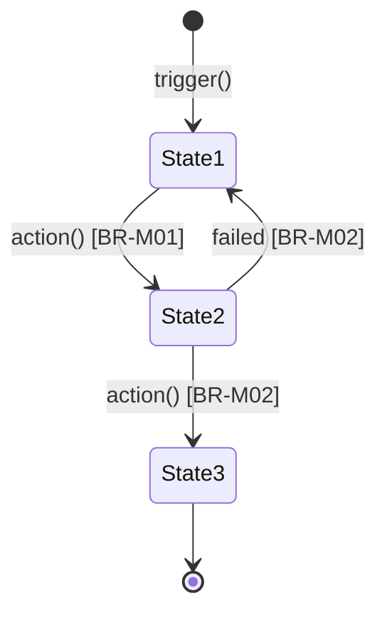

# Lean PRD — Business Rules & Workflow First

Viết PRD rút gọn cho AI-first engineering. Output tập trung vào **Business Rules** (mỗi rule = 1 testable contract) và **Workflow** (state machine) để:
1. Gen engineer (AI hoặc người) có thể code trực tiếp từ spec
2. `prd-to-gherkin` chuyển thành Gherkin feature file không cần đoán
3. `prd-to-mockup` render wireframe từ Screen States

## Triết lý

> **PRD không phải tài liệu giao tiếp — PRD là executable specification.**

Mỗi phần trong output đều có consumer rõ ràng:

```
Lean PRD section         → Consumer
────────────────────────────────────
Bối cảnh                 → Feature: description (Gherkin)
Domain Context           → Step language + domain models
Workflow                 → State machine code + scenario ordering
Business Rules           → Rule: blocks (Gherkin) + validation logic
Screen States            → prd-to-mockup → UI components
Open Questions           → # TODO: comments (Gherkin)
```

Bỏ: Success Metrics, Timeline, Assumptions, Dependencies → tách doc riêng nếu cần.

## Ngôn ngữ

**Luôn dùng tiếng Việt** cho toàn bộ nội dung PRD. Chỉ dùng tiếng Anh cho:
- Thuật ngữ kỹ thuật đã phổ biến (status, entity, trigger...)
- Mermaid syntax
- Nếu user viết tiếng Anh thì follow theo

---

## Workflow: Phỏng vấn → Viết → Review

### Phase 1 — Phỏng vấn nhanh (2-4 câu)

Không bao giờ viết spec ngay. Hỏi trước, nhưng **gọn và có mục đích**.

**Câu mở đầu:**
> "Trước khi viết spec, mô tả giúp mình: feature này giải quyết vấn đề gì, cho ai, và luồng chính (happy path) trông như thế nào?"

**Hỏi thêm chỉ khi thiếu:**

| Thiếu gì | Hỏi gì |
|---|---|
| Luồng chính chưa rõ | "Mô tả step-by-step: user bắt đầu từ đâu, làm gì, kết thúc ở đâu?" |
| Business rules mờ | "Có rule nào bắt buộc không? VD: ai được phép, điều kiện gì phải đúng, giới hạn gì?" |
| Edge cases | "Trường hợp nào user KHÔNG được làm? Hoặc hệ thống phải từ chối?" |
| Scope boundary | "Có gì chắc chắn KHÔNG nằm trong scope lần này?" |

**Dừng hỏi khi** đã có: luồng chính, 3+ business rules cụ thể, và biết scope in/out. Thường 2-4 lượt trao đổi.

**Nếu feature phức tạp** (nhiều luồng, nhiều role, integration), đọc `references/interview-guide.md` để chọn bộ câu hỏi phù hợp loại feature.

---

### Phase 2 — Viết Lean PRD

Sau phỏng vấn, generate full spec theo template bên dưới.

#### Cách viết Business Rules — mental model chính:

```
Mọi thứ user nói "bắt buộc phải", "không được phép" → Must Have
Mọi thứ user nói "nên có", "quan trọng nhưng..."    → Should Have
Mọi thứ user nói "sau này", "nếu kịp"              → Won't Have
```

Mỗi rule PHẢI thỏa:
- Là **business rule statement** (hệ thống phải enforce hoặc enable gì)
- **Testable** — viết được pass/fail test
- Có đủ: Pre-condition, Trigger, Expected Outcome, Exception
- **KHÔNG** phải UI detail ("nút phải màu xanh") hay implementation detail ("dùng REST API")

**Ví dụ tốt vs xấu:**

```
✅ Business Rule đúng chuẩn:
| BR-M01 | Chỉ merchant có gói trả phí active mới được xuất hóa đơn |
|        | Pre: merchant.subscription = active_paid                   |
|        | Trigger: merchant gửi yêu cầu xuất hóa đơn               |
|        | Expected: hóa đơn được tạo, status = "Draft"              |
|        | Exception: từ chối + thông báo "Cần nâng cấp gói"         |

❌ Sai — không testable:
"Hệ thống phải xử lý hóa đơn nhanh chóng" → nhanh là bao nhiêu?

❌ Sai — UI detail:
"Nút Submit phải ở góc phải màn hình" → không phải business rule

❌ Sai — implementation detail:
"Dùng message queue để xử lý async" → đó là technical decision
```

Xem thêm `references/business-rules-patterns.md` cho 10 pattern phổ biến.

#### Cách vẽ Workflow — dùng Mermaid state machine:

Workflow mô tả **vòng đời (lifecycle)** của entity chính trong feature. Mỗi transition phải gắn với 1+ Business Rule ID.

```
Nguyên tắc:
- Mỗi state = trạng thái observable của entity
- Mỗi transition = hành động (trigger) + điều kiện (guard = rule ID)
- Nếu feature có nhiều entity → vẽ nhiều diagram, mỗi cái cho 1 entity
- Nếu feature không có state machine (VD: pure calculation) → dùng flowchart
```

#### Cách viết Screen States:

Screen States mô tả **user nhìn thấy gì tại mỗi bước** trong workflow. Đây là input cho `prd-to-mockup` để render wireframe.

```
Nguyên tắc:
- Mỗi Screen State = 1 snapshot của UI tại 1 thời điểm
- Gắn với state trong workflow diagram
- Liệt kê: data hiển thị, field editable, actions available
- Mô tả error state khi rule bị vi phạm
- KHÔNG mô tả styling (màu, font, layout) — đó là việc của designer/mockup skill
```

---

### Phase 3 — Review

Sau khi present draft, hỏi:
> "Business Rules có miss rule nào quan trọng không? Đặc biệt các trường hợp hệ thống phải từ chối hoặc giới hạn?"

Rồi:
> "Workflow diagram có đúng với luồng thực tế không? Có transition nào thiếu?"

Cuối cùng:
> "Screen States — user nhìn thấy gì ở mỗi bước có đúng không? Có màn nào thiếu?"

---

## Output Template

Luôn dùng đúng structure này. Mỗi section bắt buộc — ghi "N/A" nếu không applicable, không được skip.

```markdown
# Lean PRD: [Tên Feature]

## Metadata
| Field | Value |
|---|---|
| Status | Draft / In Review / Approved |
| Author | [tên] |
| Ngày | [YYYY-MM-DD] |
| Version | 1.0 |
| Confluence | [link tới trang Confluence nếu có] |
| Jira Epic | [link tới Jira epic nếu có] |

---

## Bối cảnh

[2-3 câu. Ai gặp vấn đề gì, hiện tại xử lý ra sao, tại sao cần giải quyết. Không dùng ngôn ngữ giải pháp.]

---

## Domain Context

### Entities
| Entity | Mô tả | Thuộc tính chính | Invariants |
|--------|-------|-----------------|------------|
| [Entity 1] | [mô tả ngắn] | [attr1, attr2, ...] | [ràng buộc luôn đúng] |
| [Entity 2] | [mô tả ngắn] | [attr1, attr2, ...] | [ràng buộc luôn đúng] |

### Thuật ngữ (nếu có term đặc thù domain)
| Thuật ngữ | Định nghĩa | Dùng thay cho |
|-----------|-----------| --------------|
| [term] | [nghĩa] | [từ khác không dùng] |

---

## User Stories

As a [role cụ thể],
I want [khả năng],
So that [giá trị / kết quả].

[1-3 stories. Mỗi story = 1 mục tiêu riêng biệt của user.]

---

## Workflow

### State Machine



### Bảng chuyển trạng thái
| Từ | Đến | Trigger | Guard (Rule ID) | Mô tả |
|----|-----|---------|-----------------|-------|
| [State1] | [State2] | [hành động] | [BR-Mxx] | [giải thích ngắn] |

---

## Business Rules

### Must Have
*Không có những rule này, feature không hoạt động.*

| ID | Rule Statement | Pre-condition | Trigger | Expected Outcome | Exception |
|----|---------------|---------------|---------|-----------------| -----------|
| BR-M01 | [Hệ thống phải enforce/enable gì] | [điều kiện ban đầu] | [hành động kích hoạt] | [kết quả mong đợi] | [xử lý khi vi phạm] |
| BR-M02 | [Rule statement] | [pre-condition] | [trigger] | [expected] | [exception] |

### Should Have
*Quan trọng nhưng feature vẫn ship được nếu thiếu.*

| ID | Rule Statement | Pre-condition | Trigger | Expected Outcome | Exception |
|----|---------------|---------------|---------|-----------------| -----------|
| BR-S01 | [Rule statement] | [pre-condition] | [trigger] | [expected] | [exception] |

### Won't Have (version này)
*Tạm hoãn — đặt kỳ vọng rõ ràng.*

| Item | Lý do hoãn |
|------| -----------|
| [Khả năng bị hoãn] | [lý do ngắn] |

---

## Screen States

### [Tên màn hình / State name]
- **Khi nào:** [trigger — user vào từ đâu, sau action gì]
- **Hiển thị:** [data nào user nhìn thấy, nguồn data]
- **Có thể sửa:** [field nào editable]
- **Chỉ đọc:** [field nào read-only, nguồn data]
- **Actions:** [nút/link nào available] → [rule nào guard action đó]
- **Khi lỗi:** [nếu rule bị vi phạm, user thấy gì]
- **Rules active:** [BR-IDs liên quan đến màn hình này]

### [Tên màn hình tiếp theo]
...

---

## Phạm vi

### Trong scope
- [Capability 1]
- [Capability 2]

### Ngoài scope
- [Capability bị loại] — *lý do: [ngắn gọn]*

---

## Open Questions

Câu hỏi cần trả lời trước khi dev:

- [ ] **[Q1]** [Câu hỏi] → *Owner: [ai trả lời]*
- [ ] **[Q2]** [Câu hỏi] → *Owner: [ai trả lời]*

Câu hỏi có thể giải quyết trong lúc dev:

- [ ] **[Q3]** [Câu hỏi]
```

---

## Lưu PRD

PRD là tài liệu của Product, lưu trên **Confluence** (nguồn sự thật cho "tại sao làm feature này").

Khi engineer cần gen Gherkin từ PRD, chỉ cần cung cấp link Confluence. Gherkin feature file sẽ reference ngược về PRD bằng comment:

```gherkin
# PRD: https://your-site.atlassian.net/wiki/spaces/PROJ/pages/123456
# Generated from Lean PRD v1.0
```

**Không lưu PRD vào living docs repo** — repo đó chỉ chứa Gherkin + automation tests.

---

## Quality Checklist

Trước khi finalize, verify:

- [ ] Bối cảnh không có ngôn ngữ giải pháp — chỉ mô tả vấn đề
- [ ] Mỗi Must Have là business rule, KHÔNG phải UI detail hay implementation detail
- [ ] Mỗi Must Have có đủ 5 cột: Pre-condition, Trigger, Expected, Exception
- [ ] Mỗi Must Have testable — viết được pass/fail
- [ ] Workflow diagram có guard gắn với Rule ID
- [ ] Mỗi Screen State gắn với state trong workflow
- [ ] Mỗi Screen State liệt kê Rules active
- [ ] Open Questions có owner
- [ ] Spec có thể đưa thẳng cho `prd-to-gherkin` để gen Gherkin scenarios
- [ ] Spec có thể đưa thẳng cho `prd-to-mockup` để render wireframe
- [ ] Toàn bộ nội dung viết bằng tiếng Việt

---

## Handoff Notes

### → prd-to-gherkin
- Mỗi **Business Rule** (Must Have / Should Have) → 1 `Rule:` block trong feature file
- **Scenario PHẢI nằm trong Rule:** — không bao giờ có scenario độc lập ngoài Rule
- Mỗi **User Story** → persona context cho scenario steps
- **Pre-condition** → `Given`, **Trigger** → `When`, **Expected** → `Then` (happy), **Exception** → `Scenario:` error path
- **Workflow transitions** → scenario ordering + Background setup
- **Open Questions** → `# TODO:` comment trong feature file
- **Won't Have** → không generate scenario
- Steps viết bằng **tiếng Việt**, giữ tiếng Anh cho Gherkin syntax (Given, When, Then, And, But, Rule, Scenario, Feature, Background)

### → prd-to-mockup
- Mỗi **Screen State** → 1 wireframe screen
- **Hiển thị / Có thể sửa / Chỉ đọc** → layout elements
- **Actions** → buttons/links trong wireframe
- **Khi lỗi** → error state variant của wireframe
- **Workflow diagram** → screen flow / navigation map

---

## Reference Files

- `references/interview-guide.md` — Câu hỏi phỏng vấn theo loại feature (CRUD, workflow, integration, notification, calculation)
- `references/business-rules-patterns.md` — Pattern business rules phổ biến với ví dụ tốt/xấu
